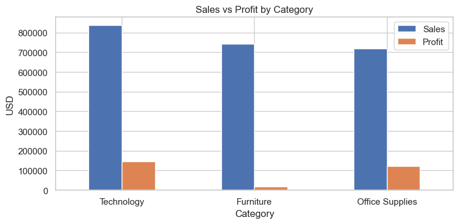
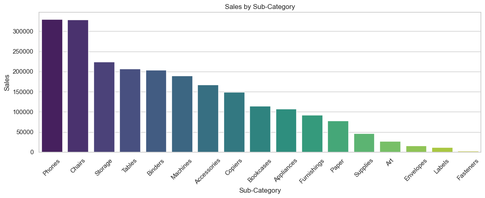
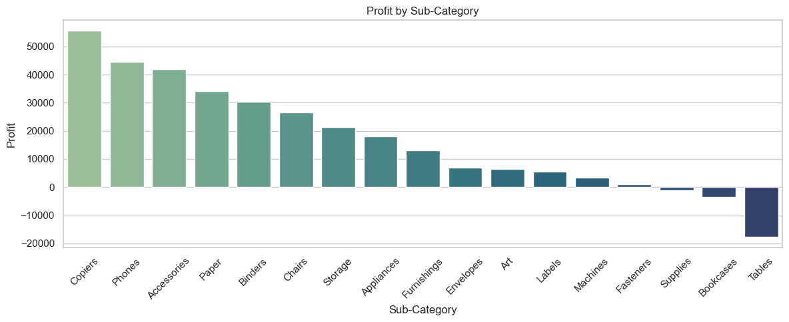
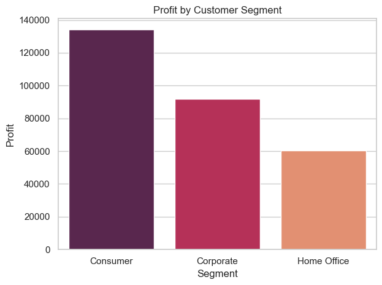
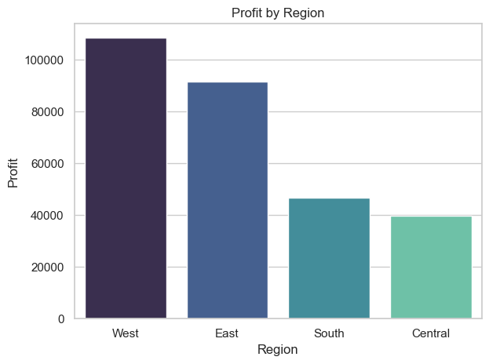
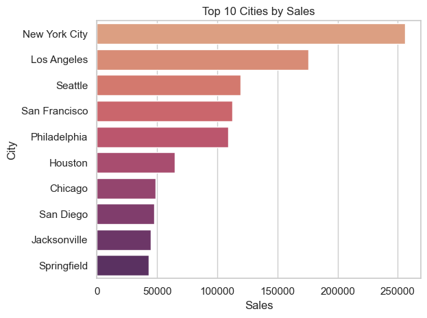
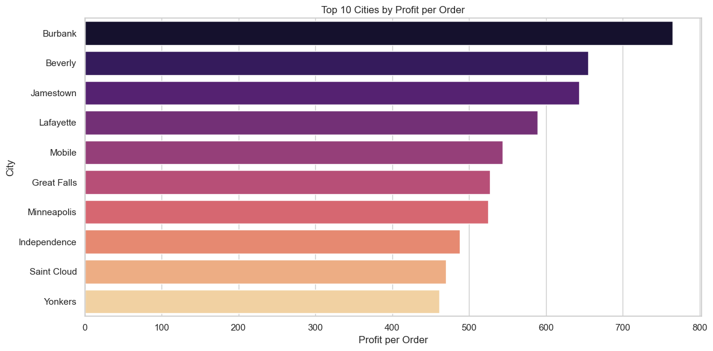
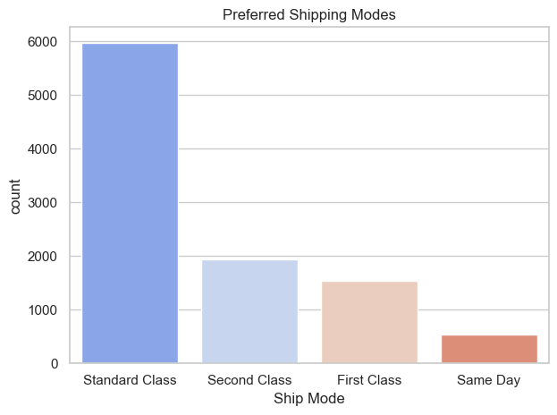
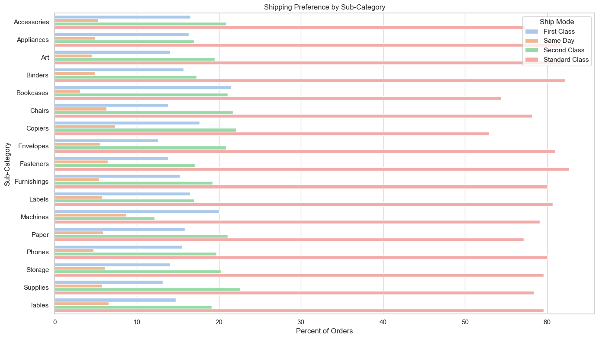
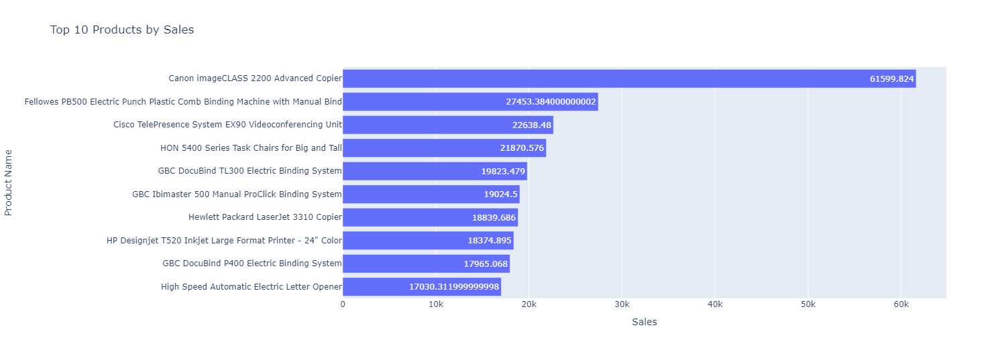

Welcome to the **Superstore Business Insights** project — a full exploratory data analysis (EDA) and business strategy breakdown for a U.S. retail superstore. This project is built with clarity, insights, and client strategy in mind under the voice of **Cowabunga Cloud Solutions 🌊**.

---

## 🧠 Overview

This project analyzes sales, profit, customer segments, and shipping trends across categories, regions, and cities. It uncovers key insights and offers strategic recommendations to help optimize business performance and boost profitability.

---

## 📂 Project Structure

superstore_business_analysis/ ├── notebooks/ │ ├── Superstore_Business_Insights.ipynb │ └── assets/ │ └── charts/ <- Saved chart images ├── venv/ <- Virtual environment (excluded from GitHub) ├── requirements.txt └── README.md <- You are here!


---

## 📸 Visual Highlights

### Sales vs Profit by Category


### Sales by Sub-Category


### Profit by Sub-Category


### Profit by Segment


### Profit by Region


### Top 10 Cities by Sales


### Top 10 Cities by Profit per Order


### Preferred Shipping Modes


### Shipping by Sub-Category


### Top 10 Products by Sales


---

## 🧩 Key Insights Summary

- **Technology** is the top-performing category in both sales and profit.
- **Furniture** has decent sales but significantly underperforms in profit — especially **Tables**, which are sold frequently but at a loss.
- **Phones** and **Copiers** dominate in both volume and profit.
- **Consumer segment** is the most profitable, while **Home Office** trails behind.
- **West and East regions** are profit leaders — the **South and Central** regions need strategic focus and shared playbooks.
- Cities like **Burbank and Jamestown** lead in **profit per order**, while **NYC and LA** dominate in volume.
- **Standard Class shipping** is preferred overall — but different sub-categories show varied preferences that could inform marketing and shipping bundling strategies.

---

## 🚀 Getting Started

### Set up the environment:
```bash
python -m venv venv
source venv/Scripts/activate   # or venv/bin/activate on Mac/Linux
pip install -r requirements.txt

jupyter notebook notebooks/Superstore_Business_Insights.ipynb


🧾 Requirements
See requirements.txt for dependencies. Main packages:
pandas
matplotlib
seaborn
plotly

👨‍💻 Author
Built by Sensei @ Cowabunga Cloud Solutions 🐢
Bringing you actionable insights, smooth dashboards, and no-nonsense data storytelling.

“If it’s got charts and chill vibes, we’re there.”

📅 Last Updated
{today}

⭐ Like what you see?
Feel free to ⭐ star the repo or connect with me on GitHub!

"""